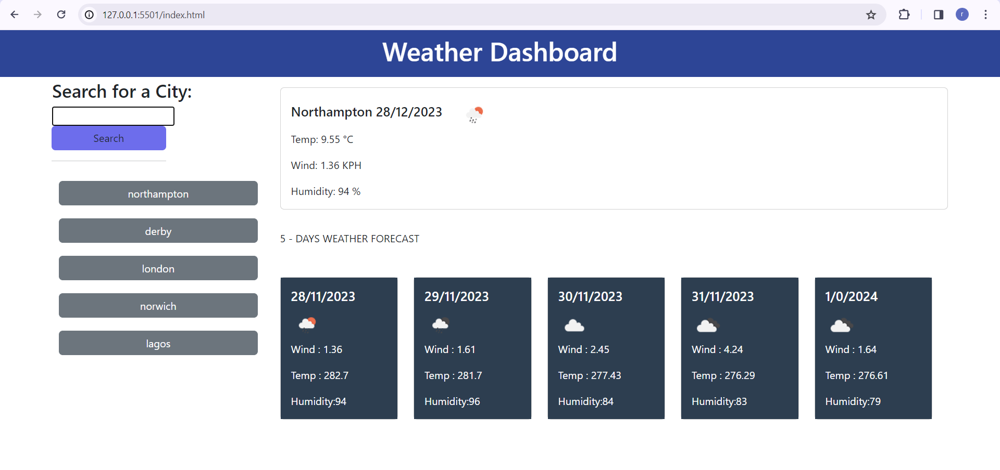

# weatherDashboard
A weather App dashboard for traveler to see the weather outlook for multiple cities


## Description
A weather App dashboard for traveler to see the weather outlook for multiple cities


## Features
- search input form,where a traveller can search for a city waether condition for that particualr day and the next five days

## Technologies Used
- Front-End: HTML, CSS, JavaScript
- Framework: Bootstrap
- APIs: 
  
## Demo png:
!

  
## Live link:
```
 https://rodiat-oluwaseun.github.io/weatherDashboard/
```
## Deployment:
```
 git clone git@github.com:Rodiat-Oluwaseun/weatherDashboard.git
```

## Challenges faced
- Difficulties in understanding the functionalities required in an API, and how to use them correctly


## License
N/A
